# Genuary (2022)

👁️ [genuary.art](https://genuary.art)

Making generative digital art each day of january, using p5.js

---

See [other’s propositions on twitter](https://twitter.com/search?q=%23GENUARY&f=live).

# day 2 | dithering

Fun with [Floyd–Steinberg dithering](https://en.wikipedia.org/wiki/Floyd%E2%80%93Steinberg_dithering) and other

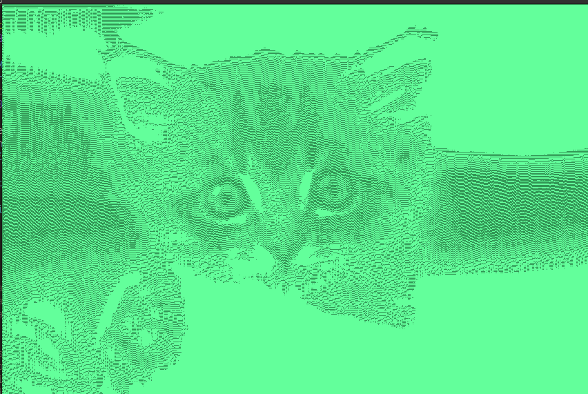 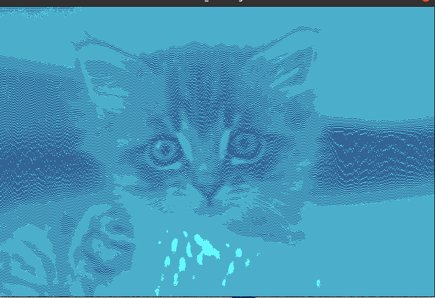
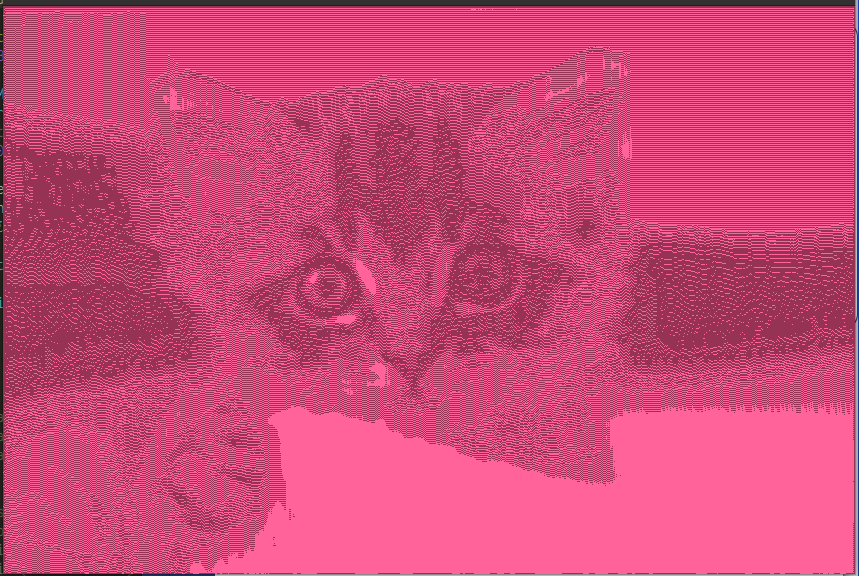 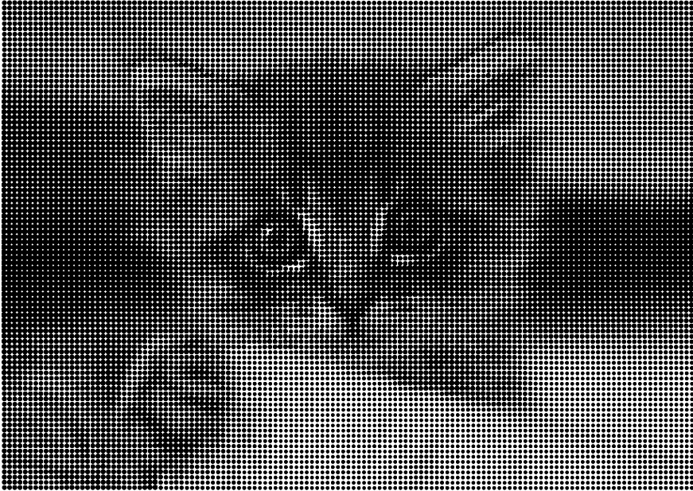

- [Dithering (warning: very slow in the p5 editor)](https://editor.p5js.org/eliseduverdier/sketches/rCXloFDUG)
- [Simple halftone](https://editor.p5js.org/eliseduverdier/sketches/ZgJCtu7Rg)

<!-- # day 3 | space -->

# day 8 | single curve only ([try it!](https://eliseduverdier.github.io/genuary/d08_single_curve_only/))

- Spirographs !
- [Watching them drawing themselves](https://editor.p5js.org/eliseduverdier/sketches/iiqB_0n9j)
- [Seeing them finished with random dimensions](https://editor.p5js.org/eliseduverdier/sketches/OQx8bRzMc)

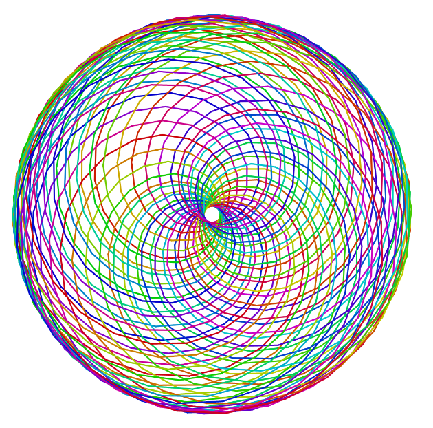 
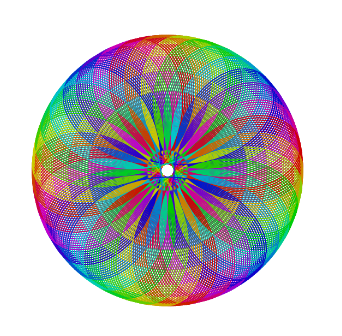 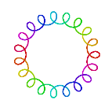
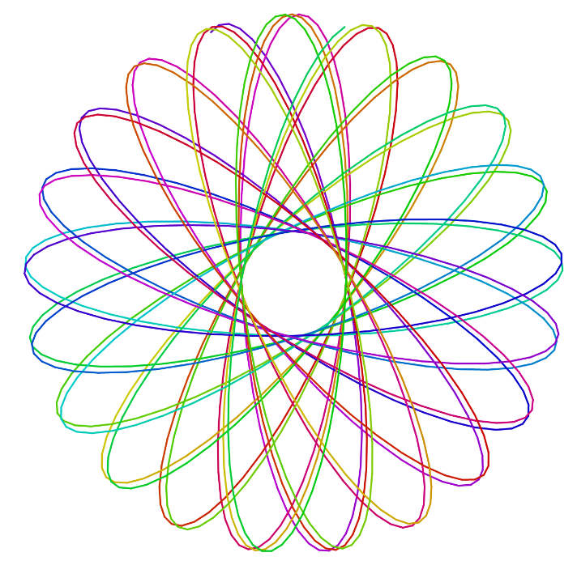 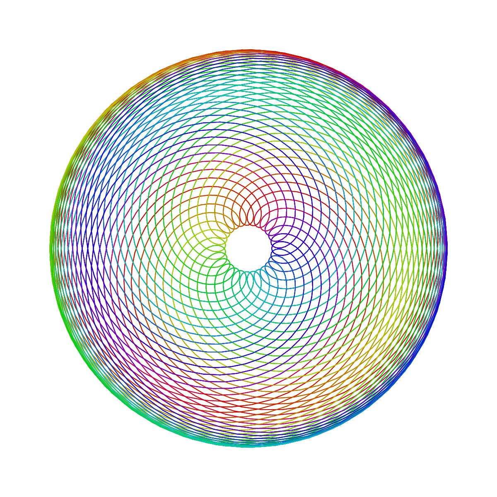

# day 13 | 800×80

- Infinite GitHub

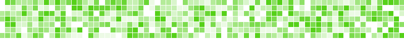

# day 15 | sand

- [Game of life/sand](https://editor.p5js.org/eliseduverdier/sketches/RsIWEAwTU)

 

# day 16 | color gradients gone wrong ([try it!](https://eliseduverdier.github.io/genuary/d16-Color-gradients-gone-wrong/))

- [Leaking rainbow](https://editor.p5js.org/eliseduverdier/sketches/kAUg9Pqlf)

# day 23 | abstract vegetation ([try it!](https://eliseduverdier.github.io/genuary/d23-Abstract-vegetation/))

- [Flowers on a grid](https://editor.p5js.org/eliseduverdier/sketches/5fHAUClrD)

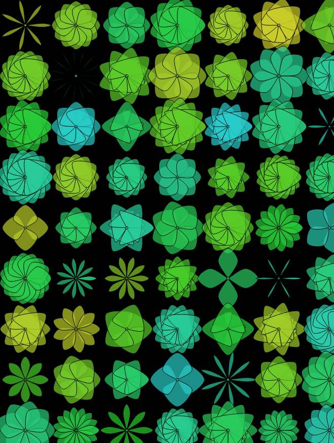 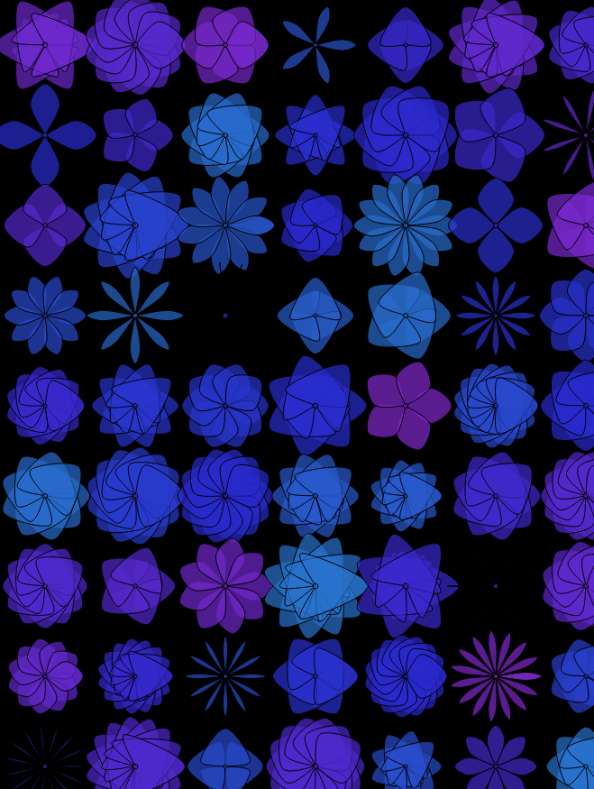 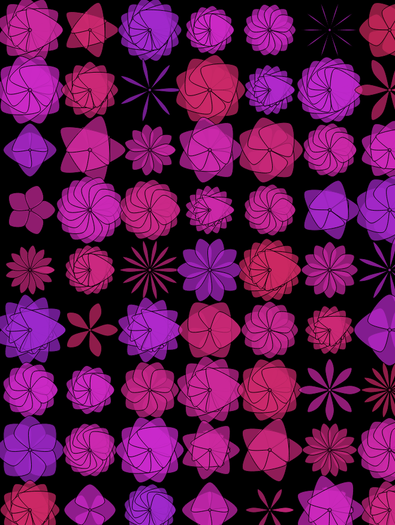 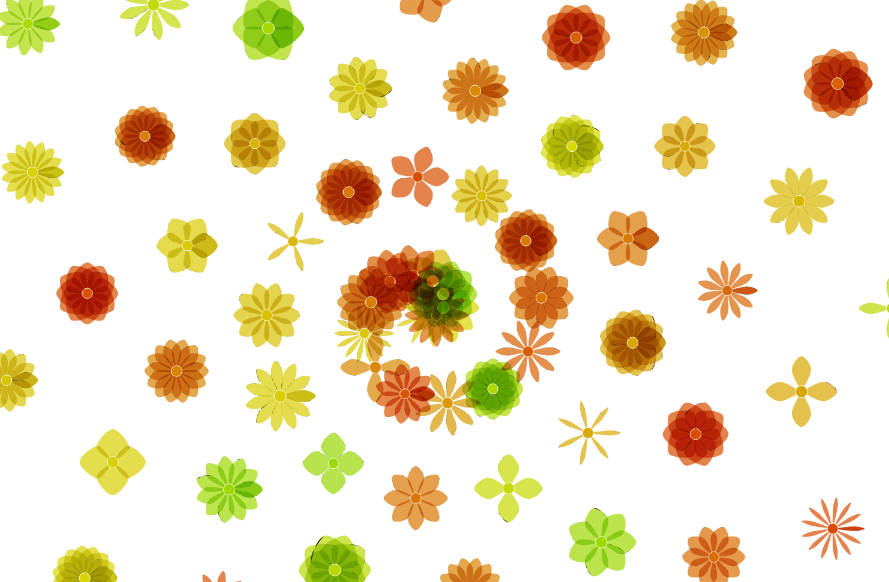

<!--
  

  Day #
  

  
  

  

  -->
